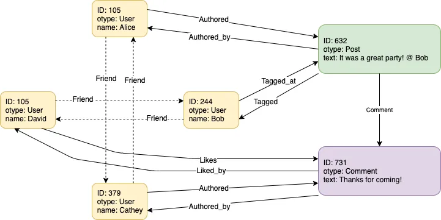

**Course Name:** Algorithmic Problem Solving  
**Course Code:** 23ECSE309  
**Name:** Prateek Kanaujia  
**SRN:** 01FE21BCS307   
**University:** KLE Technological University, Hubballi-31  
**Portfolio domain:** Facebook  

## Table of Contents
- [Introduction](#introduction)
- [Objectives](#objectives)
- [Facebook's System Architecture](#facebooks-system-architecture)
- [Business Use Cases](#business-use-cases)

## Introduction

    

Facebook, now known as Meta Platforms, began as a social media platform founded in 2004 quickly evolved into the world's largest social network, boasting nearly three billion users globally as of 2021, with about half of them engaging daily. Facebook operates primarily through revenue from advertisements on its platform, offering free access to users.

Facebook requires users to use real identities to foster genuine connections and interactions. This approach has facilitated personal relationships, information sharing, and business-consumer interactions. Initially launched as "TheFacebook" at Harvard, the platform expanded rapidly to other universities and then globally, reaching significant milestones such as adding the Wall feature in 2004, enabling friends to post on user profiles. By 2005, tagging photos and unlimited photo uploads enhanced user engagement, attracting millions from diverse demographics beyond students.

Despite efforts to improve user controls, privacy remains a contentious issue for Facebook. Commercially, Facebook's influence grew with its expansion beyond students in 2006, facilitating direct consumer engagement and advertising innovations. The company's IPO in 2012 raised $16 billion, marking a significant financial milestone and underlining its market dominance. Strategic acquisitions like Instagram and WhatsApp expanded its service portfolio, enhancing its market presence. Facebook's impact extends beyond social networking, playing pivotal roles in political movements globally, from U.S. elections to protests in Colombia and Egypt. The platform's API opened opportunities for third-party developers, fostering a robust app ecosystem and generating substantial revenue.

In recent years, Facebook rebranded as Meta Platforms in 2021, signaling a shift towards developing the metaverse—a virtual reality environment promising new interactive possibilities. Facebook/Meta Platforms has evolved from a university-based social network into a global powerhouse, reshaping communication, commerce, and societal interactions.

## Objectives
- Evaluate and classify Facebook features and technological framework.
- Investigate critical data structures , Algorithms and system design strategies used by Facebook.
- Create a resource that can be used for educational purposes to understand the intersection of data structures, algorithms, and real-world applications in a social media platform like Facebook.
- Explore opportunities for algorithmic enhancement and optimization within Facebook's operational framework.

## Facebook's System Architecture

<h3 id="facebooks-system-architecture">The Data Model For Social Graph</h3>

Facebook stores majority, if not all, of users’ data, such as profiles, friends, posts and comments, inside a single giant social graph. There are two elements inside a social graph, nodes and edges. A node represents an entity, such a user, a post, a comment and a location.
An edge represents the relationships between the nodes.

    

<h3>The Database Design For the Social Graph</h3>

Facebook uses only two database tables to represent the social graph that captures the activities of its one billion users, object table and association table.
Object table has a very simple schema. It has 3 columns. The id column stores the unique id of the object. otype stores the object type. Additionally, each object/node can have a list of key-value pairs. otype specifies the possible keys and value type. For instance, otype of User means there could be a key name with value type string. The list of key-value pairs are serialized and stored in the data column.

The schema of the association table is similar. It has 4 columns. id1 and id2 represents the source and destination of the edge. atype is the edge type and data stores the optional list of key-value pairs associated with the edge.The edge from the post to the comment will result in the following row in the association table.

<h3>The Highly Scalable Backends that Serve the Social Graph</h3>

    

In Facebook's backend system, two main components are crucial: TAO and the database. TAO serves as Facebook's distributed data store, fulfilling dual roles. First, it defines a data access API, providing interfaces for querying and modifying objects and associations. Application servers within Facebook interact with TAO rather than directly with the database. The API encompasses two main categories: object-related and association-related functionalities. Additionally, TAO operates as a write-through cache, actively caching objects and associations to minimize latency and alleviate the database system's workload.

<h3>Database</h3>

Facebook's approach to scaling its MySQL database involved two major modifications. Firstly, they implemented Database Sharding, partitioning objects and associations into logical shards distributed across database instances. TAO, their distributed data store, determines shard placement for new data and handles queries to the appropriate shard. Secondly, Facebook optimized storage efficiency by adopting the LSM (Log-Structured Merge) tree storage engine, specifically MyRocks DB. This replaced the traditional InnoDB engine's B+ trees, reducing storage requirements by 50% and enhancing database latency, particularly beneficial with the shift from HDD to Flash or SSD storage technologies.

## Business Use Cases
- [Sort Friend List](#friends)
- [Database Modification](#db-modify)
- [Friends Recommendation](#friend-recommend)
- [Auto Complete Searches](#auto)
- [Content Monitoring](#monitor)
- [Viewing Stories](#view)
- [Spam Detection](#spam)
- [News Feed Sorting & Filtering](#news-filter)
- [Data Saver](#data-saver)
- [Managing Chats & Notifications](#chats-and-notify)
- [Tag Verification](#tag)
- [Analytics and Metrics](#analyze-and-metrics)
- [Data Center Network Optimization](#optimize)
- [User Authentication](#authenticate)
- [Reminders](#reminder)
- [Notification System](#notify)

<!-- ---------------------------------------------------------------------------------------------------------------------------------------------->
<!-- 1 use case -->

<h3 id="friends">1. Sort Friends List</h3>

There are several ways of sorting the friend list, such as by recent interactions, least interacted with, and mutual friends. Using the Merge Sort algorithm, which is a divide-and-conquer approach, can significantly improve the efficiency of sorting large friends lists. Merge Sort is particularly suitable for this task due to its predictable time complexity and stable sorting nature, ensuring that the order of equal elements remains unchanged. When a user requests to view their sorted friend list, the system can quickly divide the list into smaller sublists, sort them, and then merge them back together in a sorted manner.

**Challenges**: Handling dynamically changing friends lists, ensuring low latency during sorting operations.

**Market Benefits**: Improved user experience with faster and more responsive friend list management.

**Design techniques and algorithms:**  
- **Merge Sort:** Divide-and-conquer technique
   - **Time Complexity:** O(n log n), where n is the number of friends in the list.
   - **Space Complexity:** O(n), for the temporary arrays used during the merging process.

**View Implementation:** <a href="https://github.com/Prateek307/Prateek.github.io/blob/main/Codes/MergeSort.cpp" target="_blank">Merge Sort</a>

<!-- ---------------------------------------------------------------------------------------------------------------------------------------------->
<!-- 2 use case -->

<h3 id="db-modify">2. Database Modification</h3>

Facebook’s database is based on MySQL. It is not feasible for a MySQL database to serve tens of petabytes of data efficiently. To address this, One notable optimization is the implementation of the LSM (Log-Structured Merge) tree storage engine. Originally, Facebook used the InnoDB engine, which employs B+ trees. However, B+ trees can lead to index fragmentation, resulting in wasted storage space that neither holds useful data nor can be used for new data. This issue became more pronounced as Facebook transitioned from HDD to Flash or SSD, where wasted space is more expensive. To resolve this, Facebook developed a new storage engine, MyRocks DB, based on the LSM tree. This optimization reduced storage usage by 50% and decreased database latency.

**Challenges**:  Managing massive data volumes efficiently, minimizing index fragmentation, and optimizing for SSD storage.

**Market Benefits**: Reduced storage costs, improved database performance, and enhanced scalability.

**Design techniques and algorithms:**  
- **LSM Tree Storage Engine:** Log-structured storage
   - **Time Complexity:**Varies with operations; generally O(log n) for reads and writes
   - **Space Complexity:**Efficient use of storage due to reduced fragmentation

**View Implementation:** <a href="https://engineering.fb.com/2016/08/31/core-infra/myrocks-a-space-and-write-optimized-mysql-database/" target="_blank">MyRocks DB
</a>

<!-- ---------------------------------------------------------------------------------------------------------------------------------------------->
<!-- 3 use case -->

<h3 id="friend-recommend">3. Friends Recommendation</h3>

Facebook uses advanced algorithms to recommend friends by analyzing user data and connections. One effective approach to this problem is by using the concept of degrees of separation, which can be efficiently implemented using graph traversal algorithms such as breadth-first search (BFS).

<h4>Case 1: Simplifying the Problem (Not considering millions of users)</h4>

To represent the problem, we construct a graph where each person is a node, and an edge between two nodes indicates a friendship. To find the path between two people, we start with one person and perform a simple BFS. Alternatively, bidirectional BFS can be used, which involves two simultaneous BFS operations: one from the source and one from the destination. When the searches collide, we have found a path. Depth-first search (DFS) is not suitable here as it does not guarantee finding the shortest path and can be inefficient. In the implementation, two classes, BFSData and PathNode, are used to store necessary data for the BFS, such as visited nodes and the path being traced.

<h4>Case 2: Handling Millions of Users</h4>
When dealing with millions of users, data cannot be stored on a single machine. Thus, the simple data structure for a Person needs to be adjusted to accommodate distributed storage. Instead of a list of friends, each user maintains a list of their friends' IDs. The traversal process involves determining the machine that holds a friend's data and querying that machine for the friend's information. This approach ensures efficient handling of large-scale data across multiple servers.

**Challenges**: Handling the vast number of users and their connections, ensuring efficient and accurate recommendations.

**Market Benefits**:Enhanced user engagement through accurate friend recommendations, increased user activity, and retention.

**Design techniques and algorithms:**  
- **Breadth-First Search (BFS):** Graph traversal technique
   - **Time Complexity:** O(V + E), where V is the number of vertices (users) and E is the number of edges (friend connections).
   - **Space Complexity:** O(V), for storing visited nodes and the queue.
- **Bidirectional BFS:** Optimized graph traversal
   - **Time Complexity:** O(b^(d/2)), where b is the branching factor and d is the distance between the nodes.
   - **Space Complexity:** O(b^(d/2)), for storing nodes in the queues of both searches.

**View Implementation:** 
<a href="https://github.com/Prateek307/Prateek.github.io/blob/main/Codes/RecommendCase1.java" target="_blank">Case 1</a>,
<a href="https://github.com/Prateek307/Prateek.github.io/blob/main/Codes/RecommendCase2.java" target="_blank">Case 2</a>

<!-- ---------------------------------------------------------------------------------------------------------------------------------------------->
<!-- 4 use case -->

<h3 id="auto">4. Auto Complete Searches</h3>

    The Trie data structure is utilized for efficient auto-completion of  searches based on past user inputs. The Trie stores a set of strings representing past searches by users.When a user types in a prefix of their search query, the system provides recommendations to auto-complete the query based on the stored strings in the Trie.For example, if the Trie stores {"abc", "abcd", "aa", "abbbaba"} and the user types in "ab", they should be shown {"abc", "abcd", "abbbaba"}.

**Challenges**: Handling dynamic user queries efficiently, ensuring fast response times during auto-completion.

**Market Benefits**:  Enhanced user experience with quicker and more accurate hashtag suggestions, improving user engagement.

**Design techniques and algorithms:**  
- **Trie Data Structure:** Efficient for prefix-based searches
   - **Time Complexity:** O(Q + k), where Q is the length of the query prefix and k is the number of matching words found. 
   - **Space Complexity:** O(N * L), where N is the number of strings stored in the Trie and L is the average length of these strings. 

**View Implementation:** <a href="https://github.com/Prateek307/Prateek.github.io/blob/main/Codes/Trie.cpp" target="_blank">Trie</a>

<!-- ---------------------------------------------------------------------------------------------------------------------------------------------->
<!-- 5 use case -->

<h3 id="monitor">5. Content Monitoring</h3>

   Facebook's content moderation strategy relies heavily on community flagging and human review processes to enforce community standards, including the monitoring of Facebook Live broadcasts. When content is flagged, a global team proficient in over 40 languages reviews it promptly. The Rabin-Karp string matching algorithm can efficiently detect specific patterns or content violations within posts, comments, and live videos. This algorithm enhances the team's ability to quickly identify and respond to flagged content, contributing to a safer and compliant platform environment.

**Challenges**: Ensuring real-time detection of prohibited content, handling large volumes of data efficiently.

**Market Benefits**:  Enhanced platform safety and compliance with community guidelines, fostering a trusted user environment.

**Design techniques and algorithms:**  
- **Rabin-Karp Algorithm:** String matching technique based on hashing
   - **Time Complexity:** O(n + m), where n is the length of the text and m is the length of the pattern.
   - **Space Complexity:** O(1), excluding the space required for storing the input text and pattern.

**View Implementation:** <a href="https://github.com/Prateek307/Prateek.github.io/blob/main/Codes/RabinKarp.cpp" target="_blank">Rabin-Karp</a>

<!-- ---------------------------------------------------------------------------------------------------------------------------------------------->
<!-- 6 use case -->

<h3 id="view">6. Viewing Stories</h3>

   The deque (double-ended queue) data structure is utilized in Facebook's "Viewing Stories" feature for efficient management and display of user-generated stories. Stories are temporary multimedia posts that users can view and share with their friends. Using a deque allows Facebook to efficiently manage the sequence of stories displayed to users, supporting both forward and backward navigation through the list of stories.

**Challenges**:Ensuring smooth and responsive navigation between stories, handling dynamic updates as new stories are posted.

**Market Benefits**: Enhanced user engagement with a seamless and intuitive story-viewing experience, encouraging frequent user interaction.

**Design techniques and algorithms:**  
- **Deque Data Structure:** Efficiently manages the sequence of stories
   - **Time Complexity:**  O(1) for both front and back operations.
   - **Space Complexity:** Access: O(1) for accessing elements at both ends.

**View Implementation:** <a href="https://github.com/Prateek307/Prateek.github.io/blob/main/Codes/Deque.cpp" target="_blank">Deque</a>

<!-- ---------------------------------------------------------------------------------------------------------------------------------------------->
<!-- 7 use case -->

<h3 id="spam">7. Spam Detection</h3>

For the efficient detection of spam content within posts, comments, and messages on Facebook. Hashmap and Tries can be utilized . Hashmap enables quick lookup and categorization of flagged patterns, while tries facilitate rapid matching against stored spam keywords and phrases.

**Challenges**: Ensuring real-time detection of evolving spam tactics, maintaining low latency during content evaluation.

**Market Benefits**: Enhanced user safety and experience by reducing spam visibility, improving community engagement and trust.

**Design techniques and algorithms:**  
- **Hashmaps and Tries:** Enables fast lookup and matching of spam patterns and keywords
   - **Time Complexity:**  O(L), where L is the length of the spam pattern or keyword.
   - **Space Complexity:**Efficient use of memory with hashmap and trie nodes.

**View Implementation:** <a href="https://github.com/Prateek307/Prateek.github.io/blob/main/Codes/Maps.cpp" target="_blank">Hashmaps</a>,
<a href="https://github.com/Prateek307/Prateek.github.io/blob/main/Codes/Trie.cpp" target="_blank">Tries</a>

<!-- ---------------------------------------------------------------------------------------------------------------------------------------------->
<!-- 8 use case -->

<h3 id="news-filter">8. News Feed Sorting & Filtering</h3>

Facebook's news feed algorithm condenses approximately 1,500 daily potential posts into roughly 300 prioritized ones. Factors influencing this selection include how frequently users interact with friends, pages, or public figures, the engagement levels (likes, shares, comments) of individual posts, historical interaction patterns with similar content, and the prevalence of hiding or reporting specific posts. 

B+ trees are balanced tree structures designed to maintain sorted data efficiently and support rapid access to sorted subsets of data. They strike a balance between depth and breadth, ensuring that operations such as insertion, deletion, and search maintain logarithmic time complexity relative to the number of entries. This makes B+ trees well-suited for scenarios where quick and efficient access to sorted data subsets, crucial for managing and prioritizing content in the news feed, is essential.

**Challenges**:Managing diverse content types and user preferences dynamically, ensuring timely updates and personalized feeds.

**Market Benefits**:  Improved user engagement through personalized and relevant content delivery, enhancing overall user satisfaction and interaction.

**Design techniques and algorithms:**  
- **B+ Trees:** Provides efficient indexing and sorting capabilities for news feed items
   - **Time Complexity:**  O(1) for both front and back operations.
   - **Space Complexity:** Access: O(1) for accessing elements at both ends.

**View Implementation:** <a href="" target="_blank">B+ Trees</a>

<!-- ---------------------------------------------------------------------------------------------------------------------------------------------->

<!-- 9 use case -->

<h3 id="data-saver">9. Data Saver</h3>

**Challenges**:Ensuring smooth and responsive navigation between stories, handling dynamic updates as new stories are posted.

**Market Benefits**: Enhanced user engagement with a seamless and intuitive story-viewing experience, encouraging frequent user interaction.

**Design techniques and algorithms:**  
- **Deque Data Structure:** Efficiently manages the sequence of stories
   - **Time Complexity:**  O(1) for both front and back operations.
   - **Space Complexity:** Access: O(1) for accessing elements at both ends.

**View Implementation:** <a href="https://github.com/Prateek307/Prateek.github.io/blob/main/Codes/Deque.cpp" target="_blank">Deque</a>

<!-- ---------------------------------------------------------------------------------------------------------------------------------------------->

<!-- 10 use case -->

<h3 id="chats-and-notify">10. Managing Chats & Notifications</h3>

**Challenges**:Ensuring smooth and responsive navigation between stories, handling dynamic updates as new stories are posted.

**Market Benefits**: Enhanced user engagement with a seamless and intuitive story-viewing experience, encouraging frequent user interaction.

**Design techniques and algorithms:**  
- **Deque Data Structure:** Efficiently manages the sequence of stories
   - **Time Complexity:**  O(1) for both front and back operations.
   - **Space Complexity:** Access: O(1) for accessing elements at both ends.

**View Implementation:** <a href="https://github.com/Prateek307/Prateek.github.io/blob/main/Codes/Deque.cpp" target="_blank">Deque</a>

<!-- ---------------------------------------------------------------------------------------------------------------------------------------------->