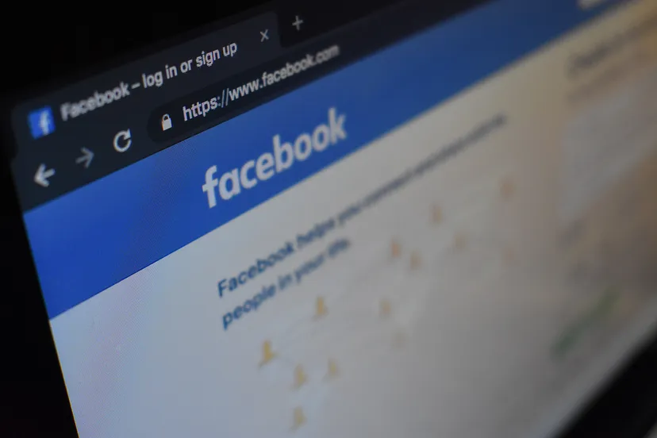

**Course Name:** Algorithmic Problem Solving  
**Course Code:** 23ECSE309  
**Name:** Prateek Kanaujia  
**SRN:** 01FE21BCS307   
**University:** KLE Technological University, Hubballi-31  
**Portfolio domain:** Facebook  

## Table of Contents
- [Introduction](#introduction)
- [Objectives](#objectives)
- [Facebook's System Architecture](#architecture-of-the-facebook)
- [Business Use Cases](#business-use-cases)

## Introduction

    

Facebook, now known as Meta Platforms, began as a social media platform founded in 2004 by Mark Zuckerberg, along with Eduardo Saverin, Dustin Moskovitz, and Chris Hughes, all Harvard University students at the time. It quickly evolved into the world's largest social network, boasting nearly three billion users globally as of 2021, with about half of them engaging daily. Headquartered in Menlo Park, California, Facebook operates primarily through revenue from advertisements on its platform, offering free access to users.

The platform allows users to create profiles, upload photos, join groups, and interact through features like Timeline, where users share personal content, and News Feed, which updates users on friends' activities. Facebook's appeal lies in its founder's emphasis on transparency, requiring users to use real identities to foster genuine connections and interactions. This approach has facilitated personal relationships, information sharing, and business-consumer interactions.
Initially launched as "TheFacebook" at Harvard, the platform expanded rapidly to other universities and then globally, reaching significant milestones such as adding the Wall feature in 2004, enabling friends to post on user profiles. By 2005, tagging photos and unlimited photo uploads enhanced user engagement, attracting millions from diverse demographics beyond students.

Privacy concerns emerged early, notably with the introduction of News Feed in 2006, which publicly displayed friends' activities, leading to swift adjustments in privacy controls. In subsequent years, missteps like the Beacon feature, which faced backlash for tracking user purchases, highlighted ongoing privacy challenges. Despite efforts to improve user controls, privacy remains a contentious issue for Facebook. Commercially, Facebook's influence grew with its expansion beyond students in 2006, facilitating direct consumer engagement and advertising innovations. The company's IPO in 2012 raised $16 billion, marking a significant financial milestone and underlining its market dominance. Strategic acquisitions like Instagram and WhatsApp expanded its service portfolio, enhancing its market presence. Facebook's impact extends beyond social networking, playing pivotal roles in political movements globally, from U.S. elections to protests in Colombia and Egypt. The platform's API opened opportunities for third-party developers, fostering a robust app ecosystem and generating substantial revenue.
In recent years, Facebook rebranded as Meta Platforms in 2021, signaling a shift towards developing the metaverse—a virtual reality environment promising new interactive possibilities. Facebook/Meta Platforms has evolved from a university-based social network into a global powerhouse, reshaping communication, commerce, and societal interactions.

